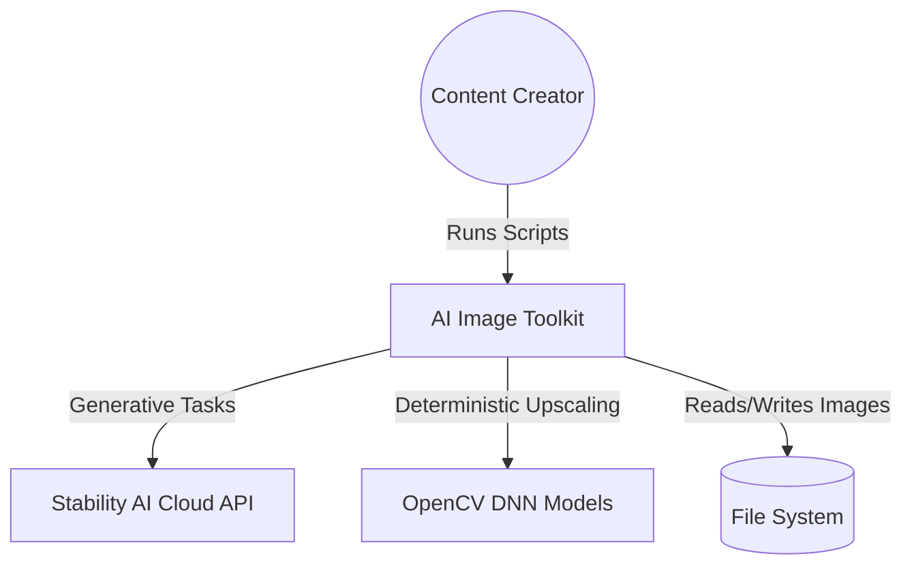
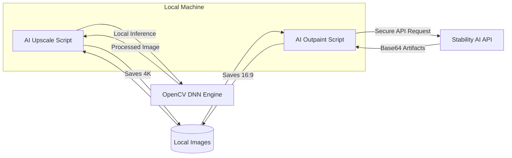
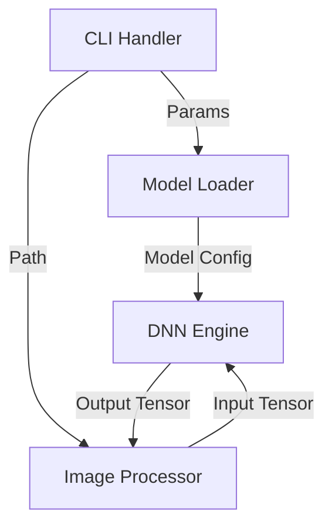
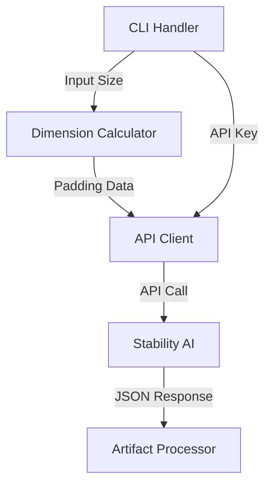

# C4 Architecture: AI Image Toolkit

This document provides a professional architectural overview of the AI Image Toolkit using the C4 model with Mermaid visualizations.

## 1. System Context Diagram (Level 1)
The AI Image Toolkit is a specialized utility suite for content creators (Social Media Managers, Video Editors).

- **Users**: Content Creators, Video Editors, Developers.
- **External Systems**:
  - **Stability AI Cloud API**: For high-end generative outpainting (9:16 to 16:9).
  - **OpenCV DNN Models**: Local pre-trained models for super-resolution (4K Upscaling).

---

## 2. Container Diagram (Level 2)
The toolkit consists of two primary processing containers.

- **AI Upscale Container (Local)**:
  - Language: Python
  - Library: OpenCV (DNN Module)
  - Responsibility: Local high-speed super-resolution processing for images.
- **AI Outpaint Container (Cloud-Hybrid)**:
  - Language: Python
  - Library: Requests, PIL
  - Responsibility: Secure API communication with Stability AI for generative outpainting.

---

## 3. Component Diagram (Level 3)
Internal components of each processing container.

### AI Upscale Components:

1. **Model Loader**: Validates and loads `.pb` model files from the `models/` directory.
2. **DNN Engine**: Performs the actual neural network inference for upscaling.
3. **Image Processor**: Handles reading/writing images and color space conversions.

### AI Outpaint Components:

1. **Dimension Calculator**: Computes target 16:9 padding from 9:16 input.
2. **API Client**: Handles authentication and multipart/form-data requests.
3. **Artifact Processor**: Decodes Base64 response artifacts and saves output.

---

## 4. Code Diagram (Level 4)
High-level code structure and flow.

- **Main Entry Point**: `ai_upscale.py` / `ai_outpaint.py`
- **Configuration**: `argparse` for CLI flexibility.
- **Core Logic**:
  - `upscale_image(input, output, scale, model)`: Core function for local SR.
  - `outpaint_image(input, output, api_key)`: Core function for cloud outpainting.

---

## Technical Rationale (Senior Decisions)
- **Decoupled Architecture**: Each processing task is a separate script to allow independent scaling and deployment.
- **Hybrid Approach**: Local execution for deterministic tasks (upscaling) and cloud execution for complex generative tasks (outpainting) to ensure high-quality results without requiring massive local GPUs.
- **Standardized I/O**: Both scripts follow consistent CLI argument patterns for easy automation in build pipelines.
