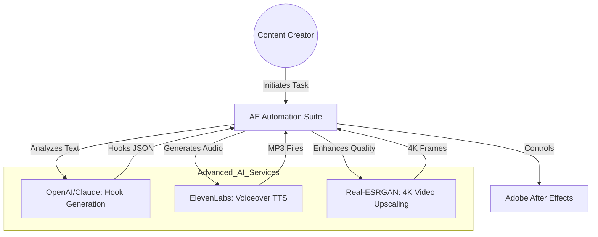
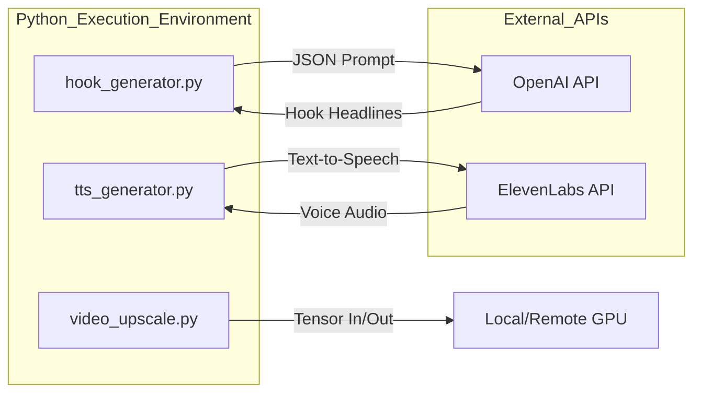

# C4 Architecture: Advanced AI Integration (Task 2)

This document provides a professional architectural overview of the integration between After Effects and advanced AI services (LLM, TTS, Real-ESRGAN).

## 1. System Context Diagram (Level 1)
The advanced AI components extend the core automation suite to provide content generation and quality enhancement.

---

## 2. Container Diagram (Level 2)
The advanced processing containers involved in the suite.

---

## 3. Component Diagram (Level 3)

### Hook Generator Components:
1. **Transcription Analyzer**: Parses raw text from `transcribe.py`.
2. **Marketing LLM Engine**: Formulates the prompt to generate high-converting hooks.
3. **JSON Serializer**: Formats the output for consumption by `hook_swapper.jsx`.

### TTS Generator Components:
1. **Language Detector**: Validates text for the ElevenLabs Multilingual V2 model.
2. **Voice Manager**: Selects and applies voice settings (stability, similarity).
3. **Audio Exporter**: Saves the generated MP3 with the correct naming convention for the localization pipeline.

### Real-ESRGAN Components:
1. **Frame Splitter**: Breaks the video into individual PNG frames.
2. **Upscaling Kernel**: Performs 4x resolution enhancement using the RRDBNet architecture.
3. **Frame Assembler**: (Optional) Recombines frames into a high-quality video file.

---

## 4. Technical Rationale
- **AI-Driven Creative**: Using LLMs to generate hooks allows for rapid A/B testing without manual brainstorming.
- **Multilingual Consistency**: ElevenLabs ensures that the same "brand voice" is maintained across all 29 supported languages.
- **Visual Fidelity**: Real-ESRGAN is chosen over standard OpenCV super-resolution because it is specifically optimized for maintaining texture and edges in video content.
