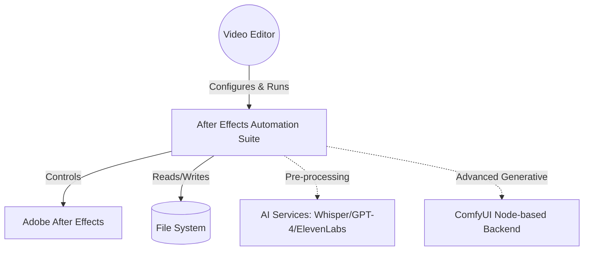
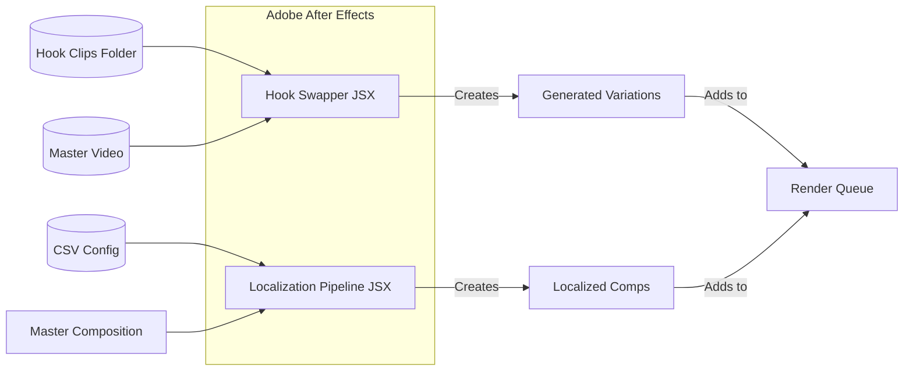
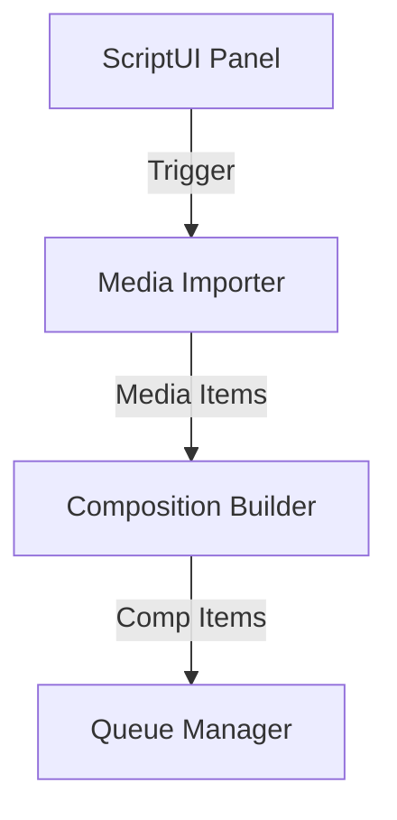
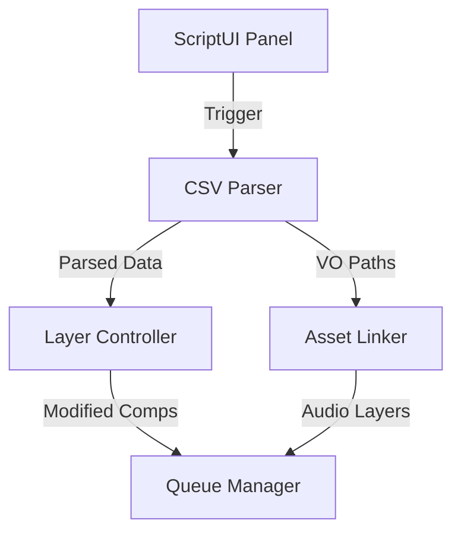

# C4 Architecture: Video Automation Suite (Task 2)

This document provides a professional architectural overview of the **Hook Swapper** and **Localization Render Pipeline** using the C4 model with Mermaid visualizations.

## 1. System Context Diagram (Level 1)
The system automates video production workflows for marketing teams.

- **Users**: Video Editors, Creative Strategists.
- **System**: After Effects Automation Suite (Task 2).
- **External Dependencies**: 
  - Adobe After Effects (Execution Environment).
  - File System (Media assets, CSV configs).
  - **ComfyUI**: Advanced Node-based AI backend for outpainting and video styling.
  - *Optional AI*: OpenAI Whisper (for pre-processing transcription), ElevenLabs (for pre-processing TTS).

---

## 2. Container Diagram (Level 2)
The suite consists of two primary ExtendScript (.jsx) containers.

- **Hook Swapper JSX**:
  - Responsibility: Combines hooks with master bodies.
  - Technology: ExtendScript (After Effects API).
- **Localization Pipeline JSX**:
  - Responsibility: Generates localized versions from CSV.
  - Technology: ExtendScript (After Effects API).

---

## 3. Component Diagram (Level 3)

### Hook Swapper Components:

1. **Media Importer**: Handles import of master and hook video files.
2. **Composition Builder**: Creates unique comps and calculates timing offsets.
3. **Queue Manager**: Automates adding generated variations to the Render Queue.

### Localization Pipeline Components:

1. **CSV Parser**: Converts raw CSV data into a JavaScript object.
2. **Layer Controller**: Targets and updates specific Text Layers by name.
3. **Asset Linker**: Imports and synchronizes voiceover files per language.

---

## 4. Pre-processing: Python & AI
**Question**: Do we need Python scripts for data pre-processing?
**Answer**: Yes, for a fully automated professional workflow, Python is highly recommended for:

1. **AI Transcription (Whisper)**: To automatically verify hook content.
2. **CSV Generation**: To use GPT-4 to translate headlines/subtitles and generate the localization table.
3. **TTS Generation**: To call ElevenLabs API and generate the voiceover files defined in the CSV.

---

## 5. Deployment & Setup
Detailed instructions can be found in:
- [DEPLOYMENT_RU.md](file:///e:/Teach/Scelar/Scelar2026/MyScripts/task2/DEPLOYMENT_RU.md) (Russian)
- [DEPLOYMENT_EN.md](file:///e:/Teach/Scelar/Scelar2026/MyScripts/task2/DEPLOYMENT_EN.md) (English)
