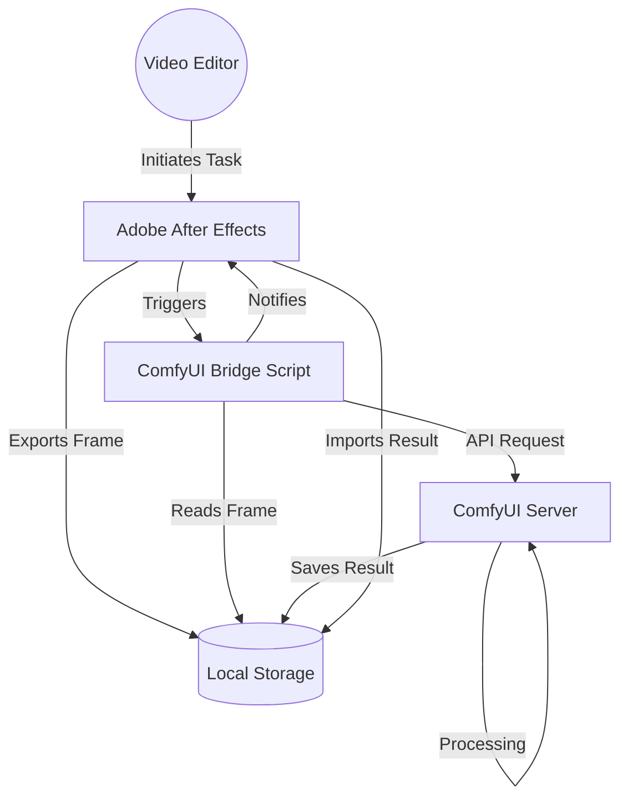
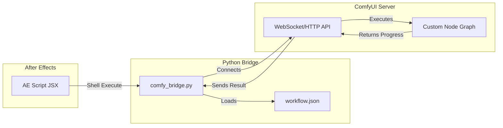
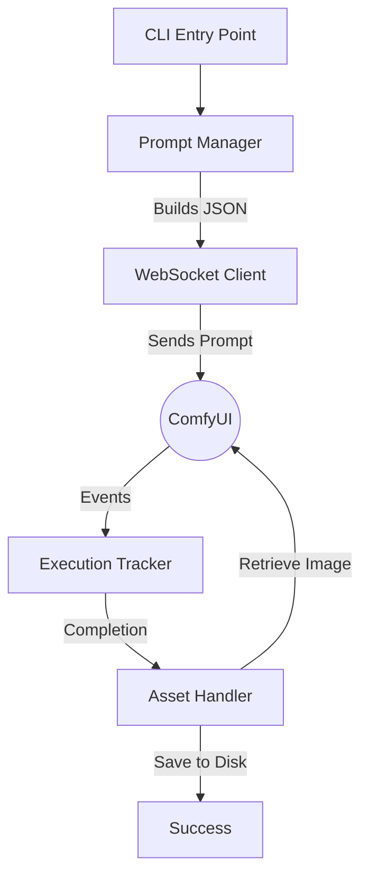

# C4 Architecture: ComfyUI Integration Bridge

This document provides a detailed architectural overview of the integration between **After Effects** and **ComfyUI** using the C4 model.

## 1. System Context Diagram (Level 1)
The ComfyUI Bridge acts as a middleware that enables professional video editors to use state-of-the-art generative AI within their AE environment.

---

## 2. Container Diagram (Level 2)
Detailed look at the technical containers involved in the bridge.

---

## 3. Component Diagram (Level 3)
Internal logic of the `comfy_bridge.py` script.

1. **Prompt Manager**: Injects dynamic values (input paths, seeds, prompts) into the static `workflow.json`.
2. **WebSocket Client**: Maintains a persistent connection for real-time progress tracking.
3. **Execution Tracker**: Monitors the ComfyUI history to detect when a specific task is finished.
4. **Asset Handler**: Handles the binary transfer of images between the server and the local filesystem.

---

## 4. Technical Rationale
- **Decoupling**: By using a standalone Python bridge, we avoid blocking the After Effects UI thread during heavy AI generation.
- **Workflow Flexibility**: The bridge is "workflow-agnostic" — you can swap `comfy_workflow.json` for any other AI task (e.g., face swap, stylization) without changing the Python code.
- **Scalability**: The `SERVER_ADDRESS` can be pointed to a remote GPU server or a local machine.
